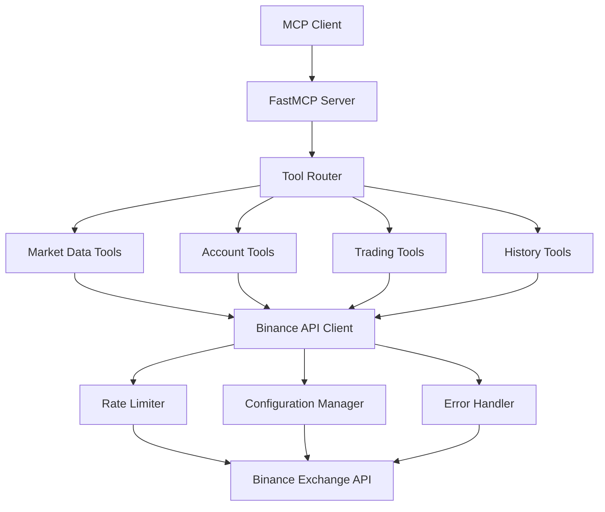

# Architecture Overview

## System Architecture

The Binance MCP Server is built on a modular architecture that separates concerns and ensures maintainability, security, and performance.

### Core Components



### Architecture Layers

#### 1. **MCP Protocol Layer**
- **FastMCP Server**: Handles MCP protocol communication
- **Transport**: STDIO, HTTP, and SSE transport support
- **Tool Registration**: Automatic tool discovery and registration

#### 2. **Application Layer**
- **Tool Modules**: 17 specialized tools for different operations
- **Response Formatting**: Standardized success/error responses
- **Input Validation**: Parameter validation and sanitization

#### 3. **Service Layer**
- **Binance Client Manager**: Centralized API client management
- **Rate Limiting**: Intelligent rate limiting to respect API limits
- **Configuration Management**: Environment-based configuration

#### 4. **Infrastructure Layer**
- **Error Handling**: Comprehensive error handling and logging
- **Security**: API key management and secure client initialization
- **Monitoring**: Request logging and performance tracking

## Tool Categories

### Market Data Tools
Tools for accessing real-time and historical market information:
- **get_ticker_price**: Current asset prices
- **get_ticker**: 24-hour price statistics
- **get_order_book**: Market depth and order book data
- **get_available_assets**: Exchange trading pairs information

### Account Management Tools  
Tools for managing account information and balances:
- **get_balance**: Account balances across all assets
- **get_account_snapshot**: Point-in-time account state
- **get_position_info**: Futures position information
- **get_pnl**: Profit and loss calculations

### Trading Tools
Tools for order management and trading operations:
- **create_order**: Place new trading orders
- **get_orders**: Retrieve order history and status

### Transaction History Tools
Tools for tracking deposits, withdrawals, and transfers:
- **get_deposit_history**: Deposit transaction history
- **get_withdraw_history**: Withdrawal transaction history
- **get_deposit_address**: Get deposit addresses for assets
- **get_liquidation_history**: Liquidation event history
- **get_universal_transfer_history**: Cross-account transfers

### Fee Information Tools
Tools for accessing trading fee information:
- **get_fee_info**: Trading fee rates and calculations

## Data Flow

### Request Flow
1. **MCP Client** sends tool request via STDIO/HTTP
2. **FastMCP Server** receives and validates the request
3. **Tool Router** dispatches to appropriate tool module
4. **Tool Module** validates parameters and calls Binance API
5. **Response** flows back through the same path with standardized format

### Error Handling Flow
1. **Error Detection** at any layer (validation, API, network)
2. **Error Classification** into categories (validation, API, rate limit, etc.)
3. **Error Response** creation with standardized format
4. **Logging** for debugging and monitoring
5. **Client Response** with actionable error information

## Security Architecture

### API Key Management
- Environment variable-based configuration
- No hardcoded credentials in source code
- Support for testnet and production environments

### Rate Limiting
- Intelligent rate limiting based on Binance API limits
- Request queuing and throttling
- Error responses when limits are exceeded

### Input Validation
- Parameter type checking and validation
- Symbol format normalization
- Order side and type validation
- Quantity and price validation

## Performance Considerations

### Caching Strategy
- No caching implemented (real-time data priority)
- Each request fetches fresh data from Binance API
- Consider implementing caching for non-critical data

### Connection Management
- Persistent client connections when possible
- Connection health checking via ping
- Automatic retry mechanisms for failed requests

### Resource Usage
- Minimal memory footprint
- Efficient JSON parsing and serialization
- Logging level configuration for performance tuning

## Configuration Management

### Environment Variables
```bash
BINANCE_API_KEY=your_api_key        # Required: Binance API key
BINANCE_API_SECRET=your_secret      # Required: Binance API secret  
BINANCE_TESTNET=true               # Optional: Use testnet (default: false)
```

### Runtime Configuration
- Dynamic client initialization
- Environment-based URL selection
- Configurable logging levels
- Transport method selection

## Extensibility

### Adding New Tools
1. Create tool module in `binance_mcp_server/tools/`
2. Implement tool function with proper error handling
3. Add tool registration in `server.py`
4. Add tests in `tests/test_tools/`
5. Update documentation

### Tool Development Guidelines
- Use `@rate_limited` decorator for API calls
- Follow standardized response format
- Implement comprehensive error handling
- Add detailed docstrings and type hints
- Include usage examples in documentation

---

This architecture ensures scalability, maintainability, and robust operation while providing a clean interface for AI agents to interact with Binance's cryptocurrency exchange.